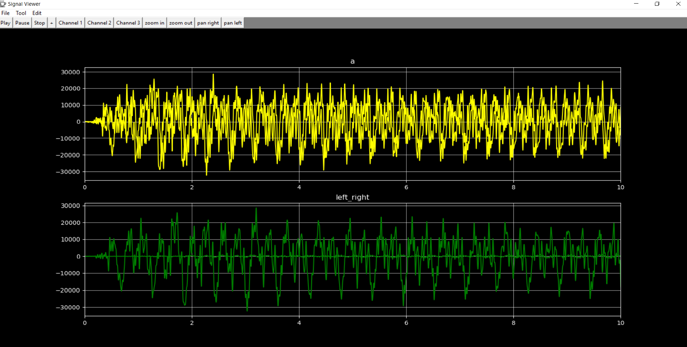
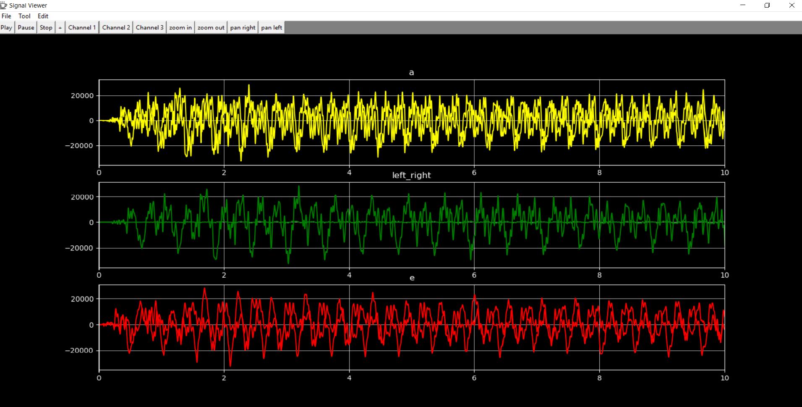
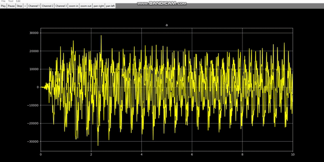

# Multi channel signal viewer program with python 
# Team members
* Abdulla elsayed
* Mohamed omar
* Galal hossam

# Main feature of the application:
* you can play each signal alone or play all of them.
* you can zoom signal in and out.
* you can pan signals right or left and also appear or disappear each signal.

